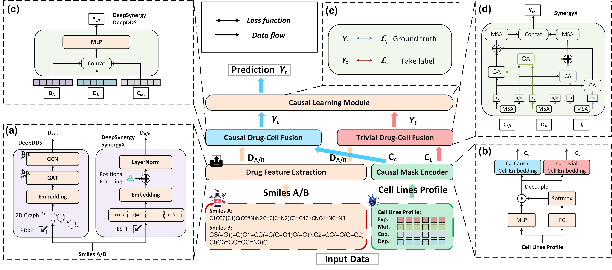

# ***CADS***

This repo is the implementation of our IEEE Journal of Biomedical and Health Informatics paper entitled [CADS: Causal Inference for Dissecting Essential Genes to Predict Drug Synergy](https://www.google.com/).
In this study, we designed a novel deep learning model ***CADS*** (Causal Adjustment for Drug Synergy) based on causal inference for the prediction of drug synergy. Then we integrated ***CADS*** into several carefully selected base models and demonstrated its efficient predictive performance through comprehensive experiments. Finally, we conducted comprehensive experiments to validate the ***CADS***'s performance and robustness, and conducted multi-granularity analyses to identify and interpret causal genes associated with drug synergy.

## Framework Overview



The pipeline of CADS. The ***CADS*** framework primarily consists of three main components: **(a)** *Drug Feature Extraction* is employed to extract drug features from sequences or 2D molecular graphs; **(b)** *Causal Mask Encoder* generates learnable causal mask pairs to decouple causal information from trivial information leveraging cell line profiles; **(c-d)** *Drug-Cell Fusion* employs Multi-Layer Perceptrons (MLP) or Cross-Attention (CA) and Multi-head Self-Attention (MSA) to fuse drug features with decoupled cell representations; **(e)** *Causal Learning Module* learns hard-to-observe causal information by training the causal and trivial components separately with ground truth and fake labels, respectively.

## Step-by-Step Guide for Running ***CADS***

### Clone the Repository

```bash
git clone git@github.com:yoshall/SINPA.git
cd SINPA
```

### Create and Activate a New Environment

```bash
conda create -n sinpa python=3.9 -y
conda activate sinpa
```

### Install Dependencies

```bash
pip install -r requirements.txt
```

### Prepare the Dataset

Put the dataset you have download from [huggingface](https://huggingface.co/datasets/Huaiwu/SINPA/tree/main) is placed in the following structure:

```bash
📂 data
└── 📁 SINPA
    ├── 📄 train.npz
    ├── 📄 val.npz
    └── 📄 test.npz
```

### (Optional) Weights & Biases

If you want to enable [Weights & Biases]() logging:

```bash
wandb login
```

### Model Training

The following examples are conducted on the base dataset of SINPA:

* Example 1 (DeepPA with default setting):

```
python ./experiments/DeepPA/main.py --dataset SINPA --mode train --gpu 0
```

* Example 2 (DeepPA without GCO):

```
python ./experiments/DeepPA/main.py --dataset SINPA --mode train --gpu 0 --GCO False
```

* Example 2 (DeepPA with the 0.7 proportion of low frequency signals):

```
python ./experiments/DeepPA/main.py --dataset SINPA --mode train --gpu 0 --GCO_Thre 0.7
```

### Model Evaluation

To test the above-trained models, you can use the following command:

* Example 1 (DeepPA with default setting):

```
python ./experiments/DeepPA/main.py --dataset SINPA --mode test --gpu 0
```

* Example 2 (DeepPA with the 0.7 proportion of low frequency signals):

```
python ./experiments/DeepPA/main.py --dataset SINPA --mode test --gpu 0 --GCO_Thre 0.7
```

## Folder Structure

We list the code of the major modules as follows:

1. The main function to train/test our model:  [click here.](experiments/DeepPA/main.py "1")
2. The source code of our model: [click here.](src/models/DeepPA.py "2")
3. The trainer/tester: [click here.](src/trainers/deeppa_trainer.py "3")
4. Data preparation and preprocessing are located at [click here.](experiments/DeepPA/main.py "4")
5. Computations: [click here.](src/utils "5")

## Arguments

We introduce some major arguments of our main function here.

Training settings:

- mode: indicating the mode (train or test).
- n_exp: experimental group number.
- gpu: which gpu used to train.
- seed: the random seed for experiments. (default: 0)
- dataset: dataset path for the experiment.
- batch_size: batch size of training or testing.
- seq_len: the length of historical steps.
- horizon: the length of future steps.
- input_dim: the dimension of inputs.
- output_dim: the dimension of inputs.
- max_epochs: maximum number of training epochs.
- patience: the patience of early stopping.
- save_preds: whether to save prediction results.
- wandb: whether to use wandb.

Model hyperparameters:

- dropout: dropout rate.
- n_blocks: number of layers of SLBlock and TLBlock.
- n_hidden: hidden dimensions in SLBlock and TLBlock.
- n_heads: number of heads in MSA.
- spatial_flag: whether to use SLBlock.
- temporal_flag: whether to use TLBlock.
- spatial_encoding: whether to treat temporal factor as a station.
- temporal_encoding: Whether to incorporate spatial factor into TLBlock.
- temporal_PE: whether to use temporal position encoding.
- GCO: whether to use GCO.
- GCO_Thre: the proportion of low frequency signals.
- base_lr: base learning rate.
- lr_decay_ratio: learning rate decay ratio.

## License

The <b>SINPA</b> dataset is released under the Singapore Open Data Licence: [https://beta.data.gov.sg/open-data-license](https://beta.data.gov.sg/open-data-license).

## Citation

If you find our work useful in your research, please cite:

```
@inproceedings{zhang2024predicting,
  title={Predicting Parking Availability in Singapore with Cross-Domain Data: A New Dataset and A Data-Driven Approach},
  author={Zhang, Huaiwu and Xia, Yutong and Zhong, Siru and Wang, Kun and Tong, Zekun and Wen, Qingsong and Zimmermann, Roger and Liang, Yuxuan},
  booktitle={Proceedings of the Thirty-third International Joint Conference on Artificial Intelligence, IJCAI-24},
  year={2024}
}
```
